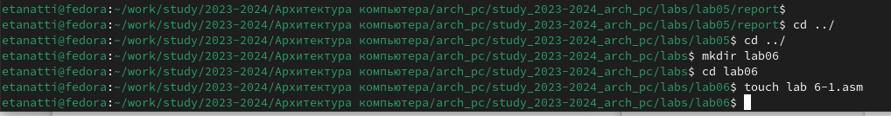
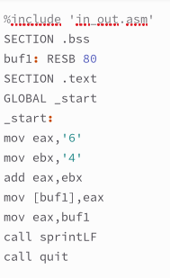
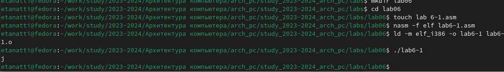
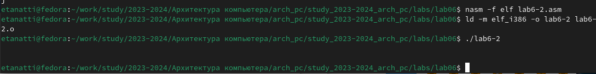
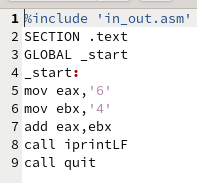
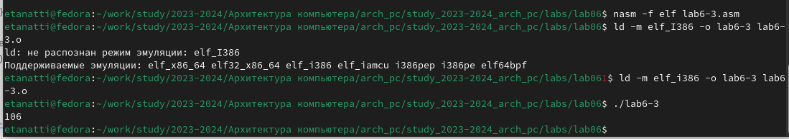
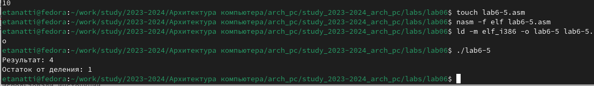

---
## Front matter
title: "Лабораторная работа №6. Арифметические
операции в NASM"
author: "**Танатти Елена Геннадьевна**"

## Generic otions
lang: ru-RU
toc-title: "Содержание"

## Bibliography
bibliography: bib/cite.bib
csl: pandoc/csl/gost-r-7-0-5-2008-numeric.csl

## Pdf output format
toc: true # Table of contents
toc-depth: 1
fontsize: 12pt
linestretch: 1.5
papersize: a4
documentclass: scrreprt
## I18n polyglossia
polyglossia-lang:
  name: russian
  options:
	- spelling=modern
	- babelshorthands=true
polyglossia-otherlangs:
  name: english
## I18n babel
babel-lang: russian
babel-otherlangs: english
## Fonts
mainfont: PT Serif
romanfont: PT Serif
sansfont: PT Sans
monofont: PT Mono
mainfontoptions: Ligatures=TeX
romanfontoptions: Ligatures=TeX
sansfontoptions: Ligatures=TeX,Scale=MatchLowercase
monofontoptions: Scale=MatchLowercase,Scale=0.9
## Biblatex
biblatex: true
biblio-style: "gost-numeric"
biblatexoptions:
  - parentracker=true
  - backend=biber
  - hyperref=auto
  - language=auto
  - autolang=other*
  - citestyle=gost-numeric
## Pandoc-crossref LaTeX customization
figureTitle: "Рис."
tableTitle: "Таблица"
listingTitle: "Листинг"
lofTitle: "Список иллюстраций"
lotTitle: "Список таблиц"
lolTitle: "Листинги"
## Misc options
indent: true
header-includes:
  - \usepackage{indentfirst}
  - \usepackage{float} # keep figures where there are in the text
  - \floatplacement{figure}{H} # keep figures where there are in the text
---

# Цель работы

Освоение арифметических инструкций языка ассемблера NASM

# Задание

1. Создайте каталог для программам лабораторной работы № 6, перейдите в него и
создайте файл lab6-1.asm:
mkdir
cd
~/work/arch-pc/lab06
~/work/arch-pc/lab06
touch lab6-1.asm

2. Рассмотрите примеры программ вывода символьных и численных значений. Программы будут выводить значения записанные в регистр eax.
Введите в файл lab6-1.asm текст программы из листинга 6.1. В данной программе в ре
гистр eax записывается символ 6 (mov eax,'6'), в регистр ebx символ 4 (mov ebx,'4').
Далее к значению в регистре eax прибавляем значение регистра ebx (add eax,ebx, ре-
зультат сложения запишется в регистр eax). Далее выводим результат. Так как для работы
функции sprintLF в регистр eax должен быть записан адрес, необходимо использовать до-
полнительную переменную. Для этого запишем значение регистра eax в переменную buf1
(mov [buf1],eax), а затем запишем адрес переменной buf1 в регистр eax (mov eax,buf1) и
вызовем функцию sprintLF.

3. Создайте исполняемый файл и запустите его.
nasm -f elf lab6-1.asm
ld -m elf_i386 -o lab6-1 lab6-1.o
./lab6-1

# Выполнение лабораторной работы

1. Создали каталог для программам лабораторной работы № 6, перейдите в него и
создайте файл lab6-1.asm:

{#fig:001 width=100%}

2. Введите в файл lab6-1.asm текст программы из листинга

{#fig:002 width=40%}

3. Создаем исполняемый файл и запускаем его, ожидаем в результате увидеть j
{#fig:003 width=100%}

4. Изменим текст программы и вместо символов, запишем в регистры числа. Исправляем текст программы, создаем исполняемый файд и запускаем его 

{#fig:004 width=40%}

5. Создадим новый файл - lab6-3.asm, используя in_out.asm: 

{#fig:005 width=100%}

6. Создаем исполняемый файл и запускаем его

{#fig:006 width=100%}

7. По аналогии меняем значения в файле, запишем его как 6-4 и запустим: 

{#fig:006 width=100%}

8. В качестве примера выполнения арифметических операций в NASM приведем про-
грамму вычисления арифметического выражения f(x) = (5x2 + 3)/3
Создадим новый файл lab6-5.asm, запишем в него код программы: 
По аналогии создаем исполняемый файл и запускаем
{#fig:007 width=100%}

# Выводы

Кажется, нельзя сказать, что освоили - немного коснулись арифметических инструкций языка ассемблера NASM

# Список литературы 
1. The GNU Project Debugger. — URL: https://www.gnu.org/software/gdb/.
2. GNU Bash Manual. — 2016. — URL: https://www.gnu.org/software/bash/manual
3. Midnight Commander Development Center. — 2021. — URL: https://midnight-commander.
org/
4. NASM Assembly Language Tutorials. — 2021. — URL: https://asmtutor.com/.
5. Newham C. Learning the bash Shell: Unix Shell Programming. — O’Reilly Media, 2005. —
354 с. — (In a Nutshell). — ISBN 0596009658. — URL: http://www.amazon.com/Learning-
bash-Shell-Programming-Nutshell/dp/0596009658.
6. Robbins A. Bash Pocket Reference. — O’Reilly Media, 2016. — 156 с. — ISBN 978-1491941591.
7. The NASM documentation. — 2021. — URL: https://www.nasm.us/docs.php.
8. Zarrelli G. Mastering Bash. — Packt Publishing, 2017. — 502 с. — ISBN 9781784396879.
9. Колдаев В. Д., Лупин С. А. Архитектура ЭВМ. — М. : Форум, 2018.
10. Куляс О. Л., Никитин К. А. Курс программирования на ASSEMBLER. — М. : Солон-Пресс,
2017.
11. Новожилов О. П. Архитектура ЭВМ и систем. — М. : Юрайт, 2016.
12. Расширенный ассемблер: NASM. — 2021. — URL: https://www.opennet.ru/docs/RUS/nasm/.
13. Робачевский А., Немнюгин С., Стесик О. Операционная система UNIX. — 2-е изд. — БХВ-
Петербург, 2010. — 656 с. — ISBN 978-5-94157-538-1.
14. Столяров А. Программирование на языке ассемблера NASM для ОС Unix. — 2-е изд. —
М. : МАКС Пресс, 2011. — URL: http://www.stolyarov.info/books/asm_unix.
15. Таненбаум Э. Архитектура компьютера. — 6-е изд. — СПб. : Питер, 2013. — 874 с. —
(Классика Computer Science)
16. Таненбаум Э., Бос Х. Современные операционные системы. — 4-е изд. — СПб. : Питер,2015 — 1120 с. — (Классика Computer Science)

